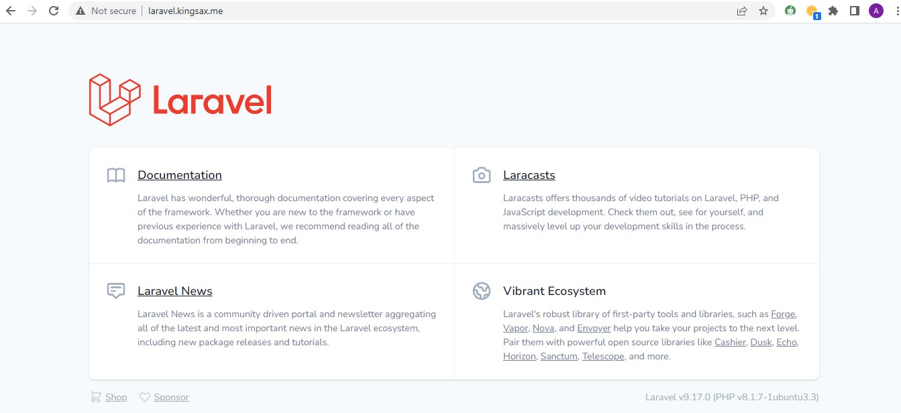
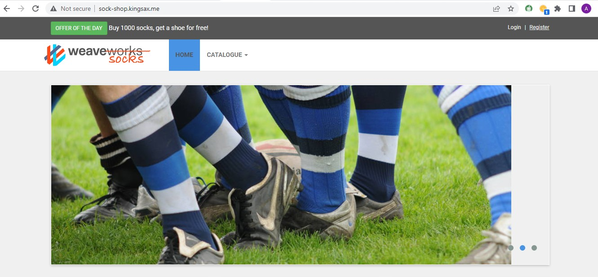
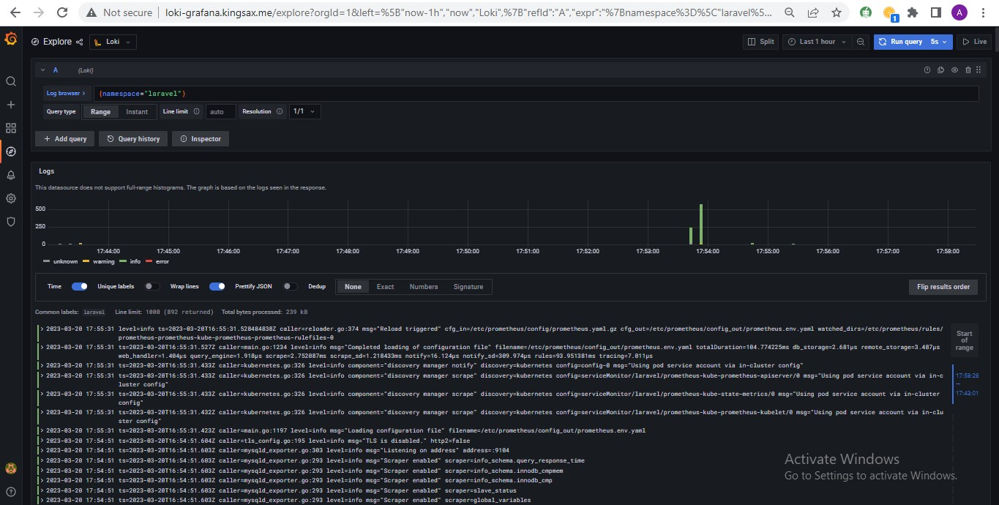
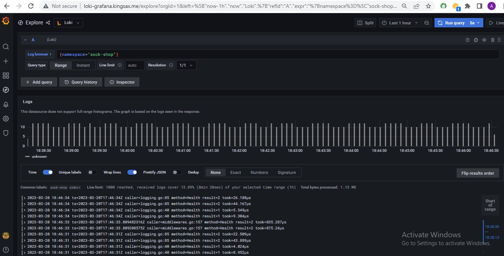
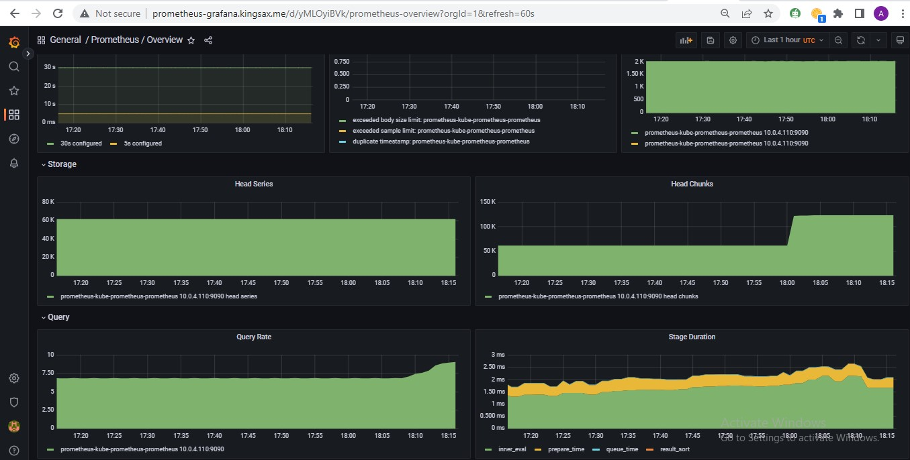
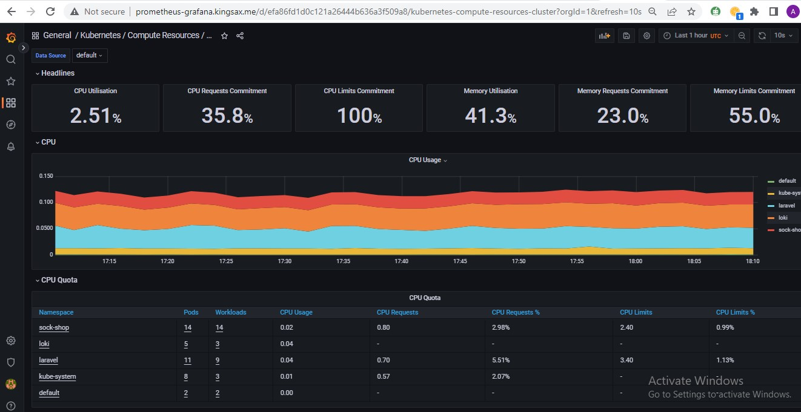
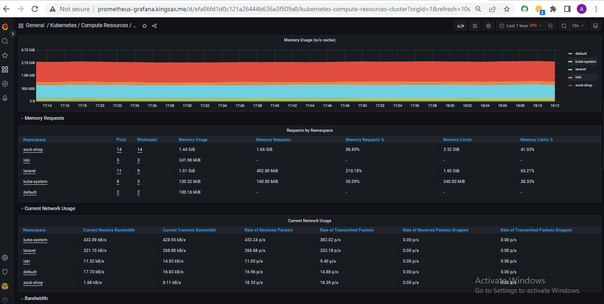

- ## Deploying two microservices based app using kubernetes  
- ## Setting up a pipeline with circle ci
- ## Setting up Prometheus, Grafana, and Loki for monitoring, metrics and logging
- ## Creating subdomains for the apps and the microservices that run inside it

### laravel app page

### sock shop app page

### loki loggings for the laravel app

### loki loggings for the sock shop app

### prometheus monitoring

### prometheus cpu usage

### prometheus memory usage
