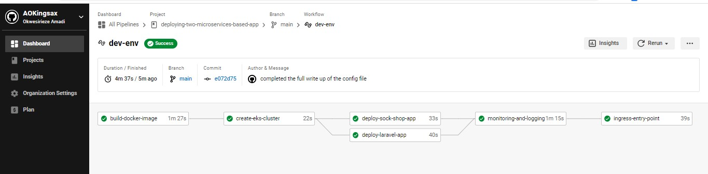
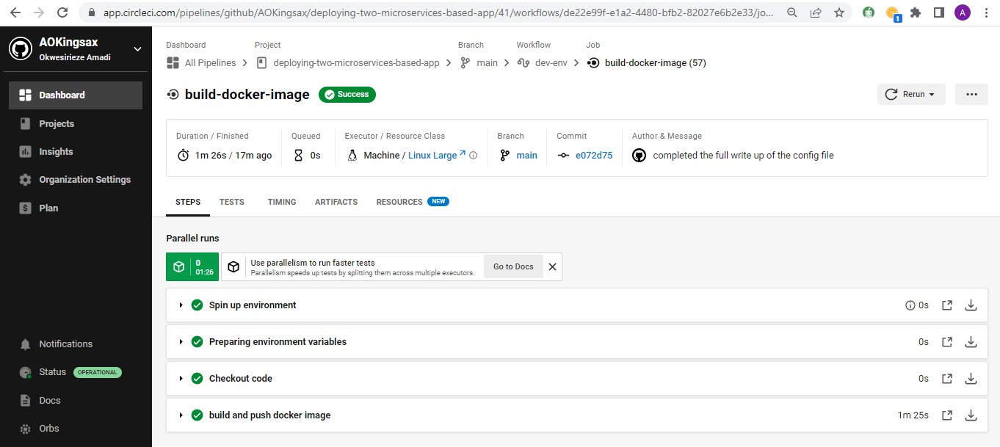
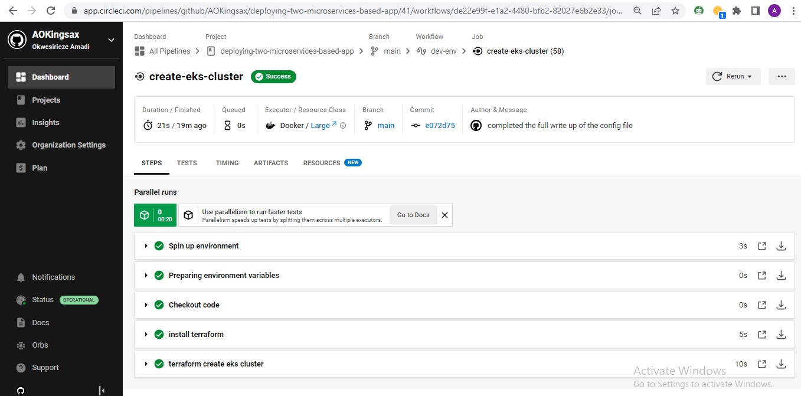
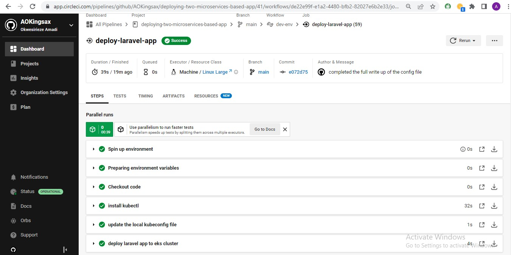
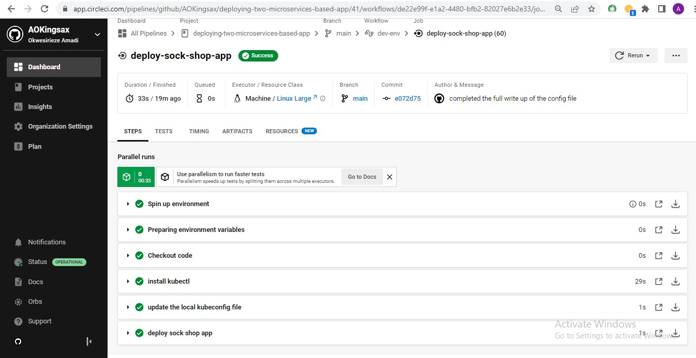
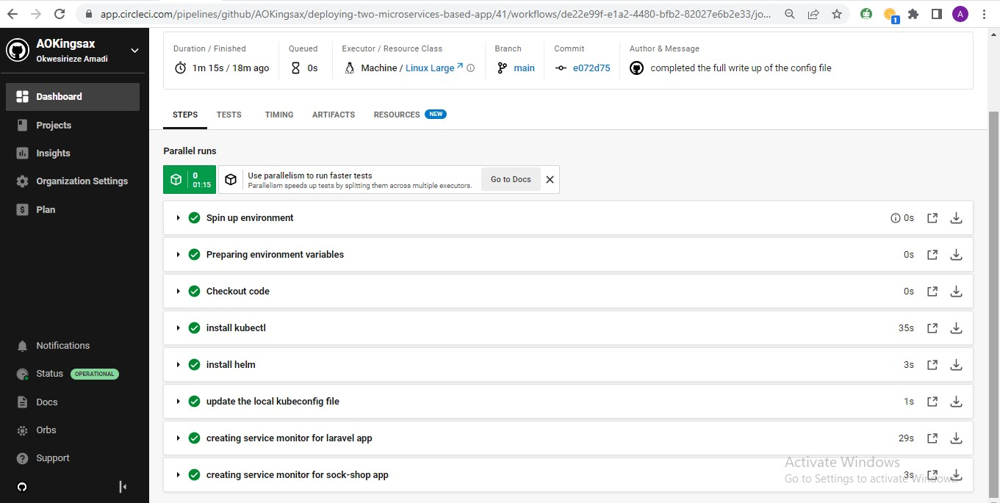

# Microservices 

Automate CI/CD Pipelines, Monitoring, Metrics & Logging for two microservices based apps

- Laravel App
- Sock Shop App

---

## Project Overview

In this project, you will apply **ALL** the skills you have acquired throughout your learning in ALTSCHOOL AFRICA SCHOOL OF ENGINEERING - CLOUD TRACK to automate the Continuous Delivery of two microservices based app including Monitoring, Metrics, and Logging.

We deploy our microservices-based architecture on Kubernetes and we need to create
a clear IaaC (Infrastructure as Code) deployment to be able to deploy our services in a
fast manner

---

## Setup

- Provision a webapp of your choosing with nginx/httpd frontend proxy and a database
  (mongo, postgresql etc) backend.

- Provision the Socks Shop example microservice application -
  https://microservices-demo.github.io/

---

## Project Tasks

- Everything needs to be deployed using an Infrastructure as Code approach
- In your solution please emphasize readability, maintainability and DevOps
  methodologies. We expect a clear way to recreate your setup and will evaluate the
  project decisions on:  
  · Deploy pipeline  
  · Metrics  
  · Monitoring  
  · Logging  
  · Use Prometheus as a monitoring tool  
  · Use Ansible or Terraform as the configuration management tool  
  · You can use an IaaS provider of your choice.  
  · The application should run on Kubernetes

---

### CircleCI Continuous Delivery Pipeline

### Build

### EKS Cluster

### Deploying both apps

### Monitoring, Metrics, and Logging

### Nginx Ingress

### laravel app page

### sock shop app page

### loki loggings for the laravel app

### loki loggings for the sock shop app

### prometheus monitoring

### prometheus cpu usage

### prometheus memory usage

